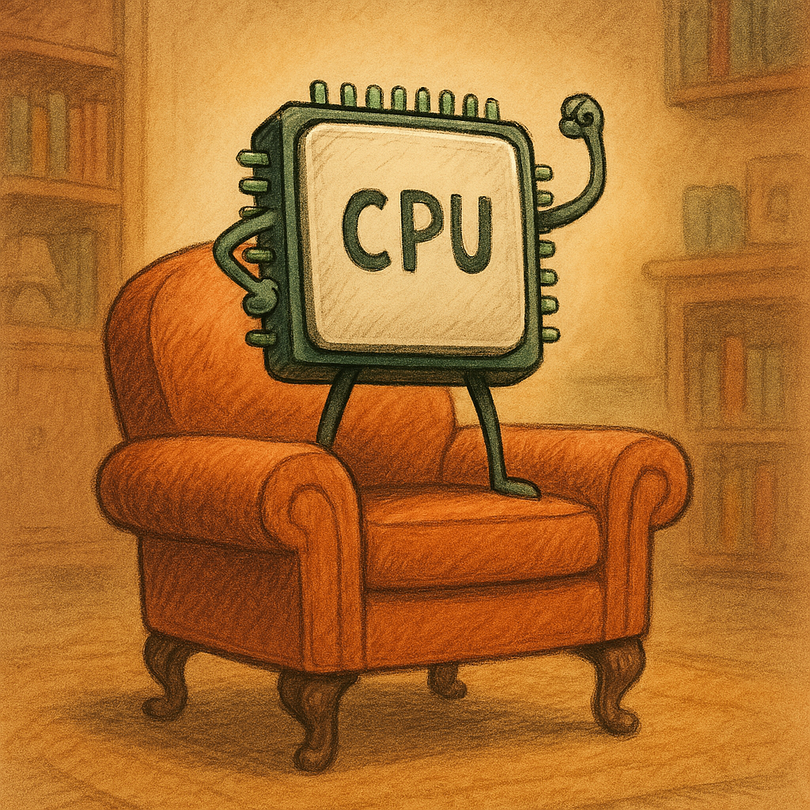

## ARMChair: Cryptographic Simulation and Analysis Tool



### Warning ⚠️

There is currently a critical bug that prevents the right instructions from being recorded. In particular, we were seeing different branching while comparing traces captured by ARMChair, leading to an incorrect intersection of the intermediates.

Basically, the `hook_code` function in Qiling wasn't working in the way that I was expecting. I assumed that I could define a `begin` and `end` using memory addresses and that the hook would be called from when we hit the start until we hit the end. 

The way that hook actually works is by checking if the pc is in between the `begin` and the end of the memory space that you ask for, plus a couple of minor checks that are not relevant. The result is that by defining a range, I was recording the registers any time that some instruction in my code would have been in that range. This led to a bunch of odd recordings that should not have been there.

I fixed this by creating my hook that is currently (27/11) being reviewed in the Qiling repo: https://github.com/qilingframework/qiling/pull/1500.

To fix the issue, after installing `qiling`, make sure to run the script `apply_qiling_patch.py` at least once before running ARMChair.

- **On Windows**:
   - Run the following command in **Command Prompt** or **PowerShell**:
     ```bash
     python tools/apply_qiling_patch.py
     ```

- **On Debian-based Linux distros or macOS**:
   - Run the following command in the terminal:
     ```bash
     python3 armchair/tools/apply_qiling_patch.py
     ```

This will copy the content of the `qilingpatch` folder into the `qiling/extensions` directory. The location of this directory will depend on where your `qiling` package is installed.

This whole section will be removed once the change is merged and published in the Qiling package.

### Overview

ARMChair is a cryptographic analysis tool designed to simulate, test, and validate cryptographic algorithms such as AES, ASCON, and KECCAK on embedded systems using the Qiling framework. It supports multiple stages, including firmware compilation, simulation, and cryptographic analysis.

ARMChair begins by building the project using `make` before executing Python scripts for the cryptographic simulation and analysis.

### Features

- **Support for multiple cryptographic algorithms:** AES, ASCON, KECCAK.
- **Support for multiple leakage models:** Identity (ID), Hamming Weight (HW), Hamming Distance (HD).
- **User-provided or auto-generated input modes** for cryptographic testing.
- **Integration with Qiling** for ARM-based platform simulation.
- **Compilation of firmware using multiple Makefiles** to support diverse platforms and algorithms.
- **Customizable input validation and padding for cryptographic algorithms.**

#### Clarification on leakage models
Under the identity (ID) model, the power consumption of each instruction is computed as the sum of the values of *all* the registers.  
Under the Hamming weight (HW) model, the power consumption of each instruction is computed as the sum of the Hamming weights of *all* registers' values.  
Under the Hamming distance (HD) model, the power consumption of each instruction is computed as the sum of the Hamming distances of *all* the registers between their value in the current state and their value in the next state.  

This implementation *does not* differentiate between registers that are accessed by the current instruction and those that aren't. Therefore, the generated power traces are usable
for statistical testing to find data-dependent leakage, but aren't an accurate power simulation on their own.

### Requirements (can be ignored if using the Docker image)

- Python 3.10 or higher (for compatibility with some of the libraries used). Tested on Python 3.12.  
    At the time of writing, it fails on Python 3.13, but it could be due to outdated wheels that may be updated in the future.
- The `make` build system (required for compiling the firmware).
- Qiling for ARM emulation.
- Required Python packages (installable via `requirements.txt`).
- Optional: [arm-none-eabi](https://developer.arm.com/downloads/-/arm-gnu-toolchain-downloads) toolchain for building the default targets.

### Installation

#### Bare metal
1. Clone the repository:

   ```bash
   git clone git@gitlab.science.ru.nl:scalab/sca-code/armchair.git
   cd armchair
   ```
   
    1. Recommended but not mandatory: create and activate a Python virtual environment:
        
        ```bash
        python -m venv venv
        source venv/bin/activate  # On Windows use `venv\Scripts\activate`
        ```
       
2. Verify that you are using Python 3.10 or higher:

   ```bash
   python --version
   ```


3. Install the required dependencies using the provided `requirements.txt`:

   ```bash
   pip install -r requirements.txt
   ```


4. Install `make` for your platform if it isn't already installed. On Debian-based Linux distributions, you can install it using:

   ```bash
   sudo apt-get install make
   ```

#### Docker
You can build this Docker image with:
``` bash
docker build -t armchair .
```
And run it with various arguments, for example:
``` bash
docker run armchair --input auto --count 10 AES
```
See the [Usage](#usage) section for more details on how to run the tool.

### Usage

Before running the cryptographic analysis, **build the project** using `make`. This is necessary for preparing the firmware and associated cryptographic targets.

#### Step 1: Building the Project (go to step 2 if using Docker)

The build system is managed using multiple Makefiles. Start by building the project with the appropriate target, which can be AES, ASCON, or KECCAK. 
You will need the `arm-none-eabi` toolchain.

```bash
make TARGET=AES
```

You can also build for ASCON or KECCAK by adjusting the `TARGET` parameter:

```bash
make TARGET=KECCAK
```
At the time of writing, ASCON compilation fails with a `dangerous relocation: unsupported relocation` during the linking stage. 
Maybe it can be fixed by using some flag, will look into this in the future.

The `Makefile` also provides options for cleaning the build or compiling for specific platforms.

- **To clean the project:**

    ```bash
    make clean
    ```

- **To specify the platform (e.g., CW308_STM32F4):**

    ```bash
    make TARGET=AES PLATFORM=CW308_STM32F4
    ```

#### Step 2: Running the Python Cryptographic Simulation

Once the project is built, you can run the cryptographic analysis using the Python scripts. ARMChair supports both user-provided and auto-generated inputs.

##### Command-Line Arguments

| Argument          | Description                                                                                                    |
|-------------------|----------------------------------------------------------------------------------------------------------------|
| `--debug`         | Enable debug mode for verbose output.                                                                          |
| `--input`         | Choose between `user` or `auto` input mode.<br/>Specify the cryptographic algorithm: `AES`, `ASCON`, `KECCAK`. |
| `--no_validation` | Disable input validation for user-provided inputs.                                                             |
| `--count`         | Number of auto-generated inputs (required for `auto` mode).                                                    |
| `--path`          | Path to the input .csv file (required for user-csv mode).                                                      |
| `--elf_path`      | Path to the .elf file (required if no SettingsLoader is implemented for user-csv and user-raw mode).           |
| `--input_format`  | Format of the inputs such as key and plaintext, either as an hex string or plaintext, hex dy default.          |
| `--key`           | The cryptographic key (hex string) for `AES`, `ASCON`, `KECCAK`.                                               |
| `--plaintext`     | The plaintext (hex string) to encrypt.                                                                         |
| `--leakage_model` | Leakage model to use for the analysis. Either `ID`, `HW`, or `HD`.<br/>Defaults to `HD`.                       |
| `--iv`            | Initialization vector (hex string) for `AES`, `ASCON`.                                                         |
| `--rounds`        | Number of rounds for the `ASCON` algorithm.                                                                    |
| `--capacity`      | Capacity for `KECCAK` sponge function.                                                                         |

##### Example 1: Running AES with user-provided input

```bash
python main.py --input user AES --key "00112233445566778899aabbccddeeff" --plaintext "00112233445566778899aabbccddeeff" --iv "000102030405060708090a0b0c0d0e0f"
```

##### Example 2: Running AES with auto-generated inputs

```bash
python main.py --input auto --count 10 AES
```
Note the ordering of the arguments. The `--input` argument must be specified before the cryptographic algorithm.
This is due to AES being a subcommand.

##### Example 3: Running AES with auto-generated inputs and a specific leakage model

```bash
python main.py --input auto --count 10 --leakage_model "HW" AES
```

##### Example 4: Running KECCAK with user-provided input

```bash
python main.py --input user KECCAK --key "00112233445566778899aabbccddeeff" --plaintext "00112233445566778899aabbccddeeff" --capacity 1600
```

### How It Works

1. **Makefile-based Firmware Compilation**: 
   The project starts with a `make` build that compiles the cryptographic firmware, producing ELF binaries based on the selected cryptographic algorithm and platform. The build process ensures that the environment is set up and the configuration files are generated.

2. **Session Setup**:
   After the build process, the Python scripts handle the session setup. It parses the command-line arguments and ensures that inputs (either user-provided or auto-generated) are ready for use in cryptographic analysis.

3. **Qiling Integration**: 
   The Qiling framework emulates the target ARM platform and executes the compiled firmware, allowing detailed tracing of cryptographic operations, including input/output and disassembly of ARM instructions.

4. **Cryptographic Analysis**: 
   ARMChair generates traces of the encryption process, useful for debugging or cryptographic analysis, including side-channel resistance.

### Supported Cryptographic Algorithms

- **AES** (Advanced Encryption Standard): Supports key, IV, and plaintext input for both user-provided and auto-generated modes.
- **ASCON**: Supports key, IV, plaintext, and round count input.
- **KECCAK**: Supports key, plaintext, and sponge capacity input.

### Debug Mode

Enable debug mode using the `--debug` flag to get verbose output of all operations, including input parsing, cryptographic operations, and Qiling interactions:

```bash
python main.py --target AES --input user --key "..." --plaintext "..." --iv "..." --debug
```

### Future Plans

- Expand support for additional cryptographic algorithms.
- Implement more advanced input generation techniques.
- Extend validation to more cryptographic modes (e.g., GCM for AES).

### License

This project is licensed under the MIT License.

